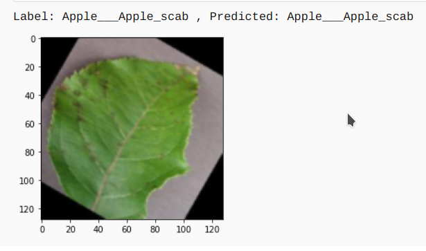
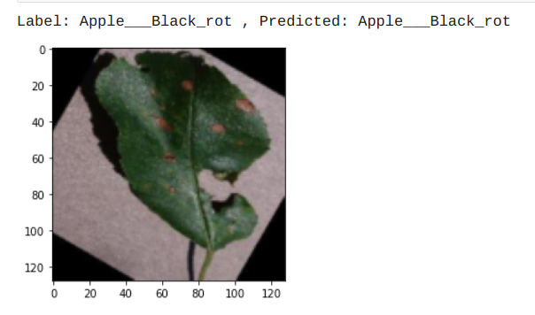

# AgriHealthGuru
### Recognition of Plant Diseases by Leaf Image Classification

## 

 

## Description

Ensuring food security for billions necessitates minimizing crop damage through timely disease detection. Effective disease detection methods boost crop yield and reduce unnecessary pesticide use, which is crucial since proper disease identification is often lacking. Alongside developing improved crop varieties, disease detection is essential for achieving food security. Traditional methods involve manual examination by farmers or experts, which are time-consuming, costly, and impractical for millions of small and medium-sized farms globally.

This project aims to develop a plant disease recognition model utilizing deep convolutional networks for leaf image classification. The model is designed to accurately identify 38 different types of plant diseases affecting 14 distinct plant species, while also proficiently distinguishing plant leaves from their surroundings.

## Leaf Image Classification

## 

This process for building a model which can detect the disease assocaited with the leaf image. The key points to be followed are:

1. Data gathering

   The dataset used was the **"New Plant Diseases Dataset"**, available for download [here](https://www.kaggle.com/vipoooool/new-plant-diseases-dataset). It comprises images of various healthy and unhealthy crop leaves.

2. Model building

   - I have used pytorch for building the model.
   - I used three models:-
     1. The CNN model architecture consists of CNN Layer, Max Pooling, Flatten a Linear Layers.
     2. Using Transfer learning VGG16 Architecture.
     3. Using Transfer learning resnet50 Architecture.
     4. AlexNet
     5. One Vs All Techniques
     6. InceptionV3 with TFRecords.

3. Training

   The model was trained by using variants of above layers mentioned in model building and by varying hyperparameters. The best model was able to achieve ~99% of test accuracy.

4. Testing

   The model was tested on total 17572 images of 38 classes. 
   The model used for prediction on sample images. It can be seen below:
   <!--  -->
   

   
   
   

5. Various Model Architecture tried along with Learning Rate and Optimizer and various accuracy obtained with different models.

#### All the version with code can be seen in `Python-Notebook-Folder` 

## Details about the model

### The model will be able to detect `38` types of `diseases` of `14 Unique plants`

- The detail list of plants and diseases can be seen in [List](Src)

## Further Work:

- Implementing Image Localisation to find the excat position of the leaf affected .
- Building Recommender system for recommendation of proper presticides and control method for the disease.
- Implementing the appropriate management strategies like fungicide applications and pesticide applications could lead to early
  information on crop health and disease detection.This could facilitate the control of diseases and improve productivity.

## Usage:

- `Flask` : Code for Flask Server and deployment
- `TestImages` : Sample image for model testing
- `Src` : All The source code for building models
- `Models` : All the Pretrained Models of Pytorch

## License

This project is Licensed under `MIT`

## Show your support

Give a ⭐ if you like this website!
